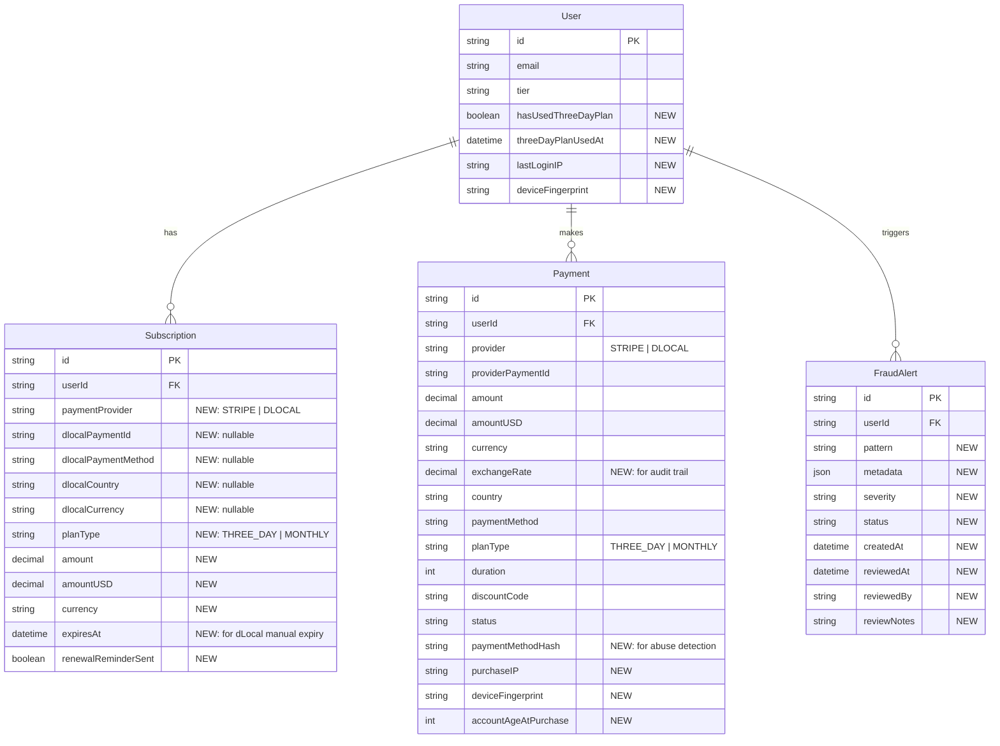
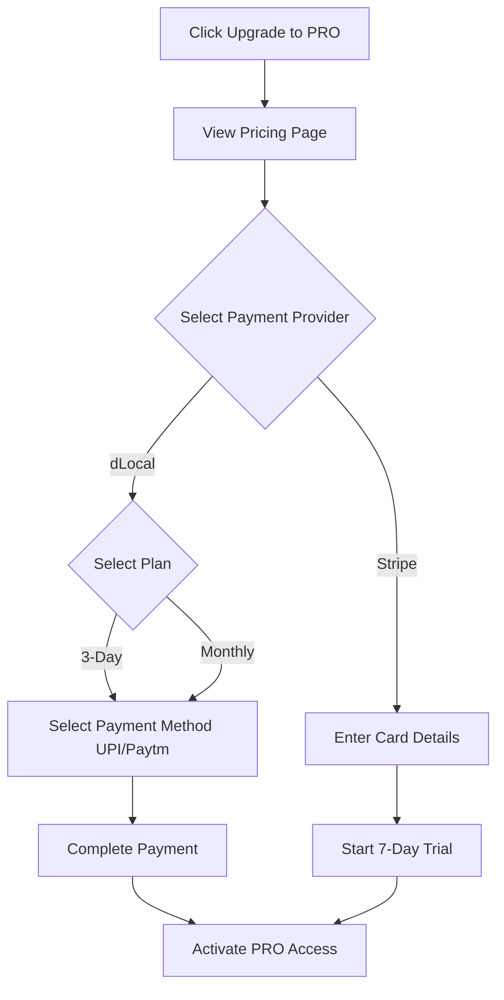

# dLocal Integration - Documentation Update Checklist

**Last Updated:** 2025-11-17
**Purpose:** Comprehensive checklist of all documentation files requiring updates for dLocal payment integration consistency across Aider + Claude Code + Human workflow

---

## ✅ COMPLETED UPDATES

### 1. Critical Workflow Files

- [x] **.aider.conf.yml** - Added `docs/policies/07-dlocal-integration-rules.md` and `docs/dlocal-openapi-endpoints.yaml` to read list
- [x] **PROGRESS.md** - Updated file count (289), part count (18), estimated time (293 hours)
- [x] **README.md** - Added dLocal features, updated API specs, updated project structure
- [x] **docs/v5-structure-division.md** - Part 18 already added (lines 1297-1715)
- [x] **docs/policies/07-dlocal-integration-rules.md** - Created comprehensive dLocal policy document
- [x] **docs/dlocal-openapi-endpoints.yaml** - Created dLocal API specification
- [x] **docs/implementation-guides/v5_part_r.md** - Created Part 18 implementation guide
- [x] **docs/DLOCAL-INTEGRATION-SUMMARY.md** - Created executive summary

---

## 📋 PENDING UPDATES

### 2. Architecture & Design Documents

#### **ARCHITECTURE.md** - ⚠️ High Priority

**Location:** `/ARCHITECTURE.md`

**Changes Needed:**

1. Add payment gateway architecture section
2. Update component diagram to show dual payment providers
3. Add dLocal API integration points
4. Document early renewal logic for dLocal subscriptions

**Specific Additions:**

```markdown
## Payment Architecture

### Dual Payment Provider System

- **Stripe**: International credit/debit cards, auto-renewal
- **dLocal**: Local payment methods (8 countries), manual renewal

### Payment Flow

1. User selects country → System detects available payment methods
2. User selects payment provider (Stripe or dLocal)
3. For dLocal: Currency conversion USD → local currency
4. Payment processed through respective provider
5. Webhook updates subscription with early renewal support

### Database Schema

- Single `Subscription` model with provider-specific fields
- `Payment` model for transaction audit trail
- `FraudAlert` model for 3-day plan abuse detection
```

---

#### **docs/diagrams/diagram-06-db-schema.mermaid** - ⚠️ High Priority

**Location:** `/docs/diagrams/diagram-06-db-schema.mermaid`

**Changes Needed:**
Add 3 new models and update Subscription/User models:



---

### 3. Policy Documents (Aider Read Files)

#### **docs/policies/00-tier-specifications.md** - ⚠️ Medium Priority

**Changes Needed:**

- No major changes needed (tier restrictions apply regardless of payment provider)
- Consider adding note that dLocal users pay in local currency but get same PRO tier benefits

---

#### **docs/policies/01-approval-policies.md** - ⚠️ Medium Priority

**Changes Needed:**
Add dLocal-specific approval criteria:

```markdown
## Payment Provider Validation

### dLocal Subscriptions

✅ AUTO-APPROVE if:

- Uses `threeDayValidator.canPurchaseThreeDayPlan()` for 3-day plans
- Implements early renewal logic (extends from current expiry)
- Marks `hasUsedThreeDayPlan = true` after 3-day purchase
- NO cancellation button (dLocal has no auto-renewal)
- Currency conversion ONLY for dLocal (not Stripe)

❌ REJECT if:

- Shows cancellation UI for dLocal users
- Applies auto-renewal logic to dLocal
- Allows 3-day plan purchase with active subscription
- Shows local currency for Stripe payments
```

---

#### **docs/policies/02-quality-standards.md** - ⚠️ Low Priority

**Changes Needed:**

- Add validation rules for payment provider conditionals
- Add test coverage requirements for dual payment system

---

#### **docs/policies/03-architecture-rules.md** - ⚠️ High Priority

**Changes Needed:**
Add payment architecture rules:

````markdown
## Payment Provider Architecture

### Rule: Single Subscription Model

- ✅ ONE `Subscription` model for both Stripe and dLocal
- ✅ Provider-specific fields are nullable
- ❌ NO separate tables for dLocal subscriptions

### Rule: Provider-Specific Logic Isolation

```typescript
// ✅ GOOD: Provider logic separated
if (subscription.provider === 'STRIPE') {
  await cancelStripeSubscription(subscription.stripeSubscriptionId);
}
if (subscription.provider === 'DLOCAL') {
  // dLocal has no cancellation - subscription naturally expires
  return { message: 'Subscription will expire on ' + expiresAt };
}

// ❌ BAD: Mixed provider logic
await cancelSubscription(subscriptionId); // Assumes auto-renewal
```
````

### Rule: Early Renewal Support (dLocal Only)

- Monthly dLocal subscriptions can be renewed BEFORE expiry
- System extends from current expiry: `remainingDays + 30 = totalDays`
- 3-day plans CANNOT be purchased if user has active subscription

````

---

#### **docs/policies/04-escalation-triggers.md** - ⚠️ Low Priority
**Changes Needed:**
Add dLocal-specific escalation triggers:

```markdown
## Payment Provider Ambiguities

🚨 ESCALATE if:
- Requirements mention "cancel subscription" without specifying provider
- Currency conversion logic unclear (Stripe vs dLocal)
- Fraud detection thresholds not defined
- Exchange rate source ambiguous
````

---

#### **docs/policies/05-coding-patterns.md** - ⚠️ Medium Priority

**Changes Needed:**
Add dLocal-specific patterns:

````markdown
## Pattern 12: Payment Provider Conditional Rendering

### Context

Show different UI based on payment provider (Stripe vs dLocal)

### Pattern

```typescript
'use client';

import { useSubscription } from '@/hooks/use-subscription';

export function SubscriptionSettings() {
  const { subscription } = useSubscription();

  return (
    <div>
      <h2>Subscription Details</h2>

      {subscription.provider === 'STRIPE' && (
        <>
          <p>Next Billing: {subscription.currentPeriodEnd}</p>
          <p>Amount: ${subscription.amount}</p>
          <p>Auto-Renewal: ON</p>
          <Button variant="destructive" onClick={handleCancelSubscription}>
            Cancel Auto-Renewal
          </Button>
        </>
      )}

      {subscription.provider === 'DLOCAL' && (
        <>
          <p>Expires: {subscription.expiresAt}</p>
          <p>Amount: {formatCurrency(subscription.amount, subscription.currency)}</p>
          <p className="text-muted">Approximately ${subscription.amountUSD} USD</p>
          <p>Auto-Renewal: Not applicable</p>
          <Button onClick={() => router.push('/checkout')}>
            Renew Subscription
          </Button>
        </>
      )}
    </div>
  );
}
```
````

````

---

#### **docs/policies/06-aider-instructions.md** - ⚠️ Medium Priority
**Changes Needed:**
Update Part 18 in the implementation order:

```markdown
## Implementation Order

### Phase 3: Autonomous Building (170 → 289 files)

**Parts 1-16:** [existing content]

**Part 17: Affiliate Marketing Platform (67 files, 120 hours)**
- Affiliate portal frontend
- Affiliate API routes
- Admin affiliate management
- Commission tracking
- Code distribution system

**Part 18: dLocal Payment Integration (52 files, 120 hours)**
- Database schema updates (User, Subscription, Payment, FraudAlert)
- dLocal API services (currency conversion, payment methods)
- Payment creation with anti-abuse validation
- Webhook handling with early renewal support
- Admin fraud monitoring dashboard
- Frontend payment selection UI
````

---

### 4. Phase Documents

#### **docs/v7/v7_phase_1_policies.md** - ⚠️ Low Priority

**Changes Needed:**

- Update policy count: 7 policies (add reference to 07-dlocal-integration-rules.md)
- Update estimated completion time if needed

---

#### **docs/v7/v7_phase_3_building.md** - ⚠️ Medium Priority

**Changes Needed:**

- Update total file count: 289 files
- Update total parts: 18 parts
- Update estimated time: 293 hours (including Part 18)
- Add Part 18 to buildorder

---

### 5. OpenAPI Specifications

#### **trading_alerts_openapi.yaml** - ⚠️ High Priority

**Changes Needed:**
Add dLocal payment endpoints to the main spec (or reference the separate dLocal spec):

```yaml
paths:
  # ... existing paths ...

  /api/payments/dlocal/methods:
    $ref: './dlocal-openapi-endpoints.yaml#/paths/~1api~1payments~1dlocal~1methods'

  /api/payments/dlocal/exchange-rate:
    $ref: './dlocal-openapi-endpoints.yaml#/paths/~1api~1payments~1dlocal~1exchange-rate'

  # ... or include all dLocal endpoints inline
```

**Alternative:** Keep `dlocal-openapi-endpoints.yaml` separate and reference it in Aider config (already done ✅)

---

### 6. User Journey Documents

#### **docs/ui-frontend-user-journey/saas-user-journey-updated.md** - ⚠️ Medium Priority

**Changes Needed:**
Update checkout journey to include dLocal option:

```markdown
## Journey 2: Upgrade to PRO

### Step 4: Payment Selection (NEW)

**Scenario:** User can choose payment method based on country

1. **Country Detection**
   - System detects user's country via IP geolocation
   - Shows relevant payment methods

2. **Payment Provider Selection**
   - Option A: Stripe (Credit/Debit Card)
     - Shows: "Credit/Debit Card - $29/month"
     - Auto-renewal: ON
     - 7-day free trial: YES

   - Option B: dLocal (Local Payment Methods)
     - Shows: UPI, Paytm, PhonePe (for India)
     - Shows: ₹2,407/month (Approximately $29 USD)
     - Auto-renewal: NO (manual renewal required)
     - 7-day free trial: NO
     - 3-day plan available: YES ($1.99 one-time)

3. **Plan Selection (dLocal Only)**
   - 3-day PRO plan: $1.99 (one-time offer, no renewal)
   - Monthly PRO plan: $29/month (manual renewal, discount eligible)

4. **Currency Display**
   - Stripe: USD only
   - dLocal: Local currency with USD reference
```

---

#### **docs/ui-frontend-user-journey/mermaid-diagrams/journey-2-upgrade-pro.mermaid** - ⚠️ Medium Priority

**Changes Needed:**
Add payment provider selection node:



---

### 7. Affiliate Documents

#### **docs/AFFILIATE-ADMIN-JOURNEY.md** - ⚠️ Low Priority

**Changes Needed:**
Add note about discount codes working with dLocal monthly plans:

```markdown
## Discount Code Compatibility

### Stripe Subscriptions

- ✅ All plans support discount codes
- ✅ 7-day free trial + discount code

### dLocal Subscriptions

- ✅ Monthly plans support discount codes
- ❌ 3-day plans DO NOT support discount codes
- ❌ No free trial period

### Affiliate Impact

- Affiliates earn commissions on dLocal monthly subscriptions
- Affiliates do NOT earn commissions on 3-day plans (too low margin)
```

---

#### **docs/AFFILIATE-MARKETING-DESIGN.md** - ⚠️ Low Priority

**Changes Needed:**
Similar to above - clarify discount code compatibility

---

#### **docs/DISCOUNT-CODE-CORRECTION-SUMMARY.md** - ⚠️ Low Priority

**Changes Needed:**
Update with dLocal 3-day plan restriction:

```markdown
## Discount Code Rules

### Updated Rules (with dLocal)

1. Stripe: All plans support discount codes
2. dLocal Monthly: Supports discount codes (20% off)
3. dLocal 3-Day: NO discount codes (prevents abuse)
```

---

### 8. Journey Diagrams (Affiliate)

#### **ui-frontend-user-journey/journey-4-affiliate-registration.mermaid** - ⚠️ Very Low Priority

**Changes Needed:** None (affiliate registration unaffected by payment provider)

#### **ui-frontend-user-journey/journey-5-affiliate-dashboard.mermaid** - ⚠️ Very Low Priority

**Changes Needed:** None (commission tracking works regardless of payment provider)

#### **ui-frontend-user-journey/journey-6-admin-affiliate-management.mermaid** - ⚠️ Very Low Priority

**Changes Needed:** None

---

### 9. Miscellaneous Documents

#### **AFFILIATE-MARKETING-INTEGRATION-CHECKLIST.md** - ⚠️ Very Low Priority

**Changes Needed:** None

#### **AFFILIATE-SYSTEM-COMPREHENSIVE-UPDATE-SUMMARY.md** - ⚠️ Very Low Priority

**Changes Needed:** None

#### **AFFILIATE-SYSTEM-SETTINGS-DESIGN.md** - ⚠️ Very Low Priority

**Changes Needed:** None

#### **AFFILIATE-SYSTEM-UPDATES-NEEDED.md** - ⚠️ Very Low Priority

**Changes Needed:** None

#### **SUBSCRIPTION-MODEL-CLARIFICATION.md** - ⚠️ Low Priority

**Changes Needed:**
Add dLocal subscription model:

```markdown
## Subscription Models by Provider

### Stripe

- Auto-renewal: YES
- Free trial: 7 days
- Plans: Monthly only
- Cancellation: Yes (stops auto-renewal)

### dLocal

- Auto-renewal: NO (manual renewal required)
- Free trial: NO
- Plans: 3-day (one-time) + Monthly
- Cancellation: Not applicable (subscription expires naturally)
- Early renewal: YES (stacks remaining days + new period)
```

---

## 📊 Update Priority Summary

| Priority     | Files   | Status      |
| ------------ | ------- | ----------- |
| **High**     | 4 files | ⚠️ Pending  |
| **Medium**   | 6 files | ⚠️ Pending  |
| **Low**      | 8 files | ⚠️ Pending  |
| **Very Low** | 6 files | ⚠️ Optional |
| **Complete** | 8 files | ✅ Done     |

---

## 🎯 Recommended Update Sequence

### Phase 1: Critical for Aider Workflow (Do First)

1. ✅ .aider.conf.yml
2. ✅ PROGRESS.md
3. ✅ README.md
4. ⚠️ ARCHITECTURE.md
5. ⚠️ docs/diagrams/diagram-06-db-schema.mermaid
6. ⚠️ docs/policies/03-architecture-rules.md
7. ⚠️ trading_alerts_openapi.yaml (or keep separate - already in .aider.conf.yml)

### Phase 2: Important for Code Quality (Do Second)

8. ⚠️ docs/policies/01-approval-policies.md
9. ⚠️ docs/policies/05-coding-patterns.md
10. ⚠️ docs/policies/06-aider-instructions.md
11. ⚠️ docs/v7/v7_phase_3_building.md

### Phase 3: Documentation Consistency (Do Third)

12. ⚠️ docs/ui-frontend-user-journey/saas-user-journey-updated.md
13. ⚠️ docs/ui-frontend-user-journey/mermaid-diagrams/journey-2-upgrade-pro.mermaid
14. ⚠️ docs/AFFILIATE-ADMIN-JOURNEY.md
15. ⚠️ docs/DISCOUNT-CODE-CORRECTION-SUMMARY.md
16. ⚠️ SUBSCRIPTION-MODEL-CLARIFICATION.md

### Phase 4: Optional Enhancements (Do Last or Skip)

17. Low priority affiliate documents
18. Very low priority journey diagrams

---

## ✅ Validation Checklist

Before Phase 3 (Autonomous Building), verify:

- [ ] All **High Priority** files updated
- [ ] Aider config includes all 8 policy documents
- [ ] Database schema diagram reflects all 4 models (User, Subscription, Payment, FraudAlert)
- [ ] Architecture document explains dual payment provider system
- [ ] Policy documents include dLocal-specific rules
- [ ] OpenAPI specs include dLocal endpoints (via reference or inline)
- [ ] User journey documents explain payment provider selection

---

## 📝 Notes

1. **Aider Read List:** The most critical update was adding `07-dlocal-integration-rules.md` to `.aider.conf.yml` (✅ Complete)

2. **Separate vs Inline:** dLocal OpenAPI endpoints can stay in separate file (`dlocal-openapi-endpoints.yaml`) since it's already in Aider's read list

3. **Policy Documents:** Focus on updating policy files that guide code generation (01, 03, 05, 06)

4. **Diagrams:** Database schema diagram is important for visual reference during building

5. **User Journeys:** Important for UI/UX consistency but not critical for backend logic

---

**Last Updated:** 2025-11-17
**Created By:** Claude (AI Assistant)
**Status:** Ready for user review and selective updates
