# Rise Payment Integration Stack - Architecture Design Document

**Project**: Trading Alerts SaaS V7  
**Component**: Automated Affiliate Commission Payment System  
**Integration**: Rise.works Payment API  
**Version**: 1.0.0  
**Date**: November 2025  
**Document Type**: Architecture Design (What Is)

---

## Table of Contents

1. [Executive Summary](#executive-summary)
2. [System Context](#system-context)
3. [Architecture Overview](#architecture-overview)
4. [Component Architecture](#component-architecture)
5. [Data Architecture](#data-architecture)
6. [Integration Architecture](#integration-architecture)
7. [Security Architecture](#security-architecture)
8. [Configuration Architecture](#configuration-architecture)
9. [Testing Architecture](#testing-architecture)
10. [Deployment Architecture](#deployment-architecture)
11. [Monitoring & Observability](#monitoring--observability)
12. [Future Considerations](#future-considerations)

---

## Executive Summary

### Purpose

This document defines the architecture for integrating Rise.works payment infrastructure into Trading Alerts SaaS V7 to enable automated global affiliate commission payments. The architecture supports phased deployment: mock mode during MVP stage, seamless transition to live payments post-approval.

### Key Architectural Principles

1. **Abstraction**: Payment provider agnostic design enabling multiple payment backends
2. **Modularity**: Loosely coupled components with clear interfaces
3. **Configuration-Driven**: Environment-based provider switching without code changes
4. **Fail-Safe**: Graceful degradation when payment services unavailable
5. **Auditability**: Complete transaction trail for compliance and debugging
6. **Testability**: Mock implementations for comprehensive testing without external dependencies

### Design Goals

- Zero downtime transition from mock to live payments
- Support for 190+ countries and multiple currencies
- Automated commission calculation and disbursement
- Comprehensive audit trail for financial compliance
- Extensible to support multiple payment providers
- Integration with existing V7 authentication and authorization

---

## System Context

### Existing V7 Architecture Components

```
Trading Alerts SaaS V7
├── Frontend: Next.js 15 (TypeScript)
├── Backend: Flask (Python)
├── Database: PostgreSQL (Railway)
├── MT5 Service: Flask + MetaTrader 5
├── Authentication: JWT-based
└── Deployment: Docker + Railway + GitHub Actions
```

### Rise Payment Integration Position

The Rise payment stack integrates at the **backend service layer**, sitting between the core application logic and external payment infrastructure.

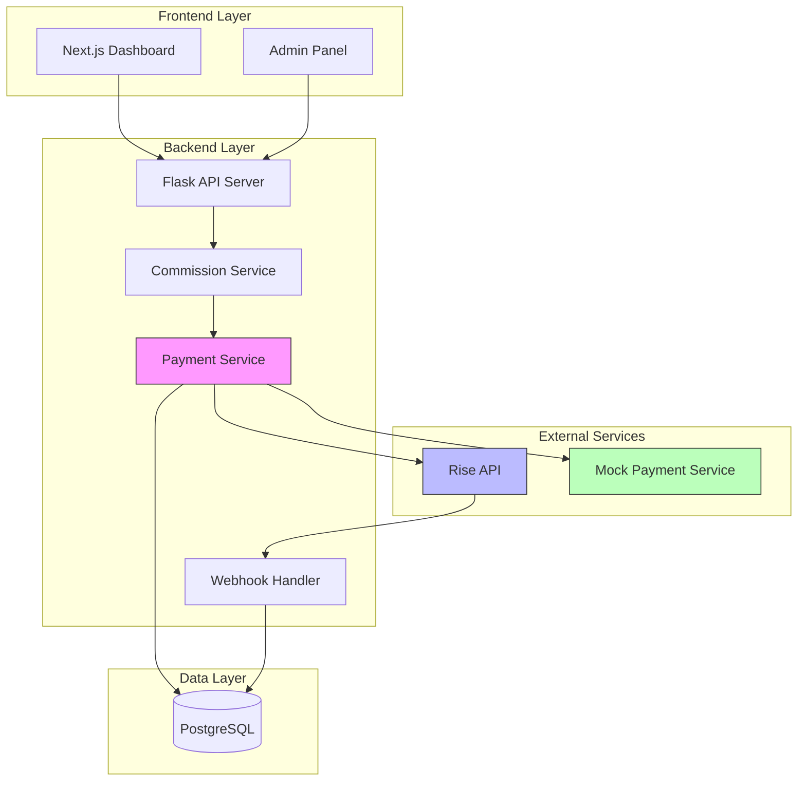

### Integration Boundaries

**Internal Dependencies:**

- User authentication system
- Subscription management
- Affiliate tracking system
- Admin dashboard

**External Dependencies:**

- Rise.works REST API
- Ethereum wallet (for API authentication)
- Webhook endpoints (for payment status)

---

## Architecture Overview

### High-Level Architecture

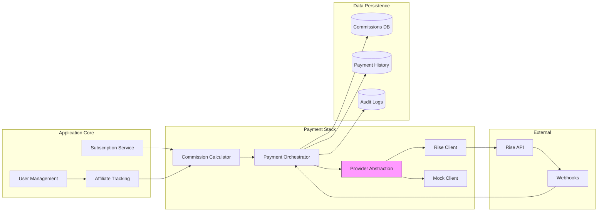

### Architectural Layers

#### 1. **Presentation Layer** (Existing V7)

- Admin dashboard for commission management
- Affiliate portal for payment history
- Payment status monitoring interfaces

#### 2. **Application Layer** (New Payment Stack)

- Commission calculation engine
- Payment orchestration service
- Batch payment scheduler
- Webhook event processor

#### 3. **Integration Layer** (Provider Abstraction)

- Abstract payment interface
- Rise API client implementation
- Mock payment provider
- Provider factory and configuration

#### 4. **Data Layer** (Extended V7 Schema)

- Affiliate management tables
- Commission tracking tables
- Payment history tables
- Audit and reconciliation tables

---

## Component Architecture

### Component Diagram

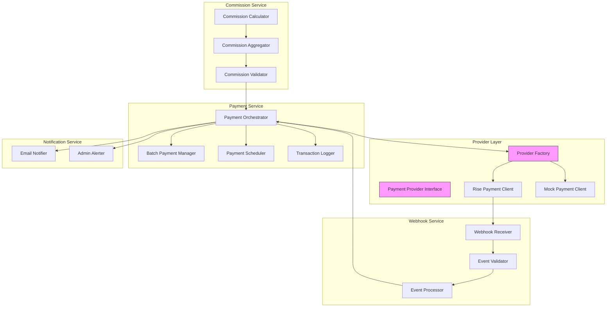

### Core Components

#### 1. **Commission Calculator**

**Purpose**: Calculate affiliate commissions based on subscription events

**Responsibilities:**

- Apply commission rates based on affiliate tier
- Handle different subscription types (FREE → PRO conversions)
- Calculate recurring vs one-time commissions
- Apply minimum payout thresholds
- Handle commission adjustments (refunds, chargebacks)

**Inputs:**

- Subscription events (new, upgrade, renewal, cancellation)
- Affiliate configuration (rates, tiers)
- Payment history (for recurring calculations)

**Outputs:**

- Commission records with amounts
- Aggregated commission totals
- Commission eligibility status

**State:**

- Stateless service
- All state in database

#### 2. **Payment Orchestrator**

**Purpose**: Coordinate payment execution across providers

**Responsibilities:**

- Determine when to execute payments
- Select appropriate payment provider
- Handle payment lifecycle (initiate → confirm → complete)
- Manage payment retries on failure
- Coordinate with notification service
- Maintain transaction audit trail

**Inputs:**

- Approved commission records
- Payment schedule configuration
- Provider availability status

**Outputs:**

- Payment execution results
- Transaction records
- Status notifications

**State:**

- Tracks in-flight payments
- Maintains retry counters
- Stores provider selection logic

#### 3. **Payment Provider Interface**

**Purpose**: Abstract payment provider implementations

**Contract:**

```python
class PaymentProvider(ABC):
    @abstractmethod
    async def authenticate() -> AuthToken

    @abstractmethod
    async def send_payment(
        payee_id: str,
        amount: Decimal,
        currency: str,
        metadata: dict
    ) -> PaymentResult

    @abstractmethod
    async def send_batch_payment(
        payments: List[Payment]
    ) -> BatchPaymentResult

    @abstractmethod
    async def get_payment_status(
        transaction_id: str
    ) -> PaymentStatus

    @abstractmethod
    async def get_payee_info(
        payee_id: str
    ) -> PayeeInfo

    @abstractmethod
    async def handle_webhook(
        event: WebhookEvent
    ) -> WebhookResponse
```

**Implementations:**

- `RisePaymentClient`: Production Rise.works integration
- `MockPaymentClient`: Testing and development
- `Future`: Stripe, PayPal, Wise (extensibility)

#### 4. **Rise Payment Client**

**Purpose**: Implement Rise.works API integration

**Responsibilities:**

- Authenticate with Rise API using wallet signatures
- Execute individual payments via `/payments/pay` endpoint
- Execute batch payments via `/payments/batch-pay` endpoint
- Handle Rise-specific payment flow (typedData signing)
- Process Rise webhook events
- Manage Rise API rate limiting
- Handle Rise-specific error codes

**Configuration:**

- API base URL (staging/production)
- Wallet private key (for signing)
- RiseID (company account identifier)
- API timeout settings
- Retry policies

**Dependencies:**

- Ethereum wallet library (ethers.js/web3.py)
- HTTP client with retry logic
- Signature generation utilities

#### 5. **Mock Payment Client**

**Purpose**: Simulate payment operations for testing

**Responsibilities:**

- Simulate successful payments
- Simulate various failure scenarios
- Generate realistic transaction IDs
- Simulate network latency
- Provide controllable test scenarios

**Features:**

- Configurable success/failure rates
- Delayed payment confirmations
- Webhook simulation
- No external dependencies

#### 6. **Batch Payment Manager**

**Purpose**: Optimize payment execution through batching

**Responsibilities:**

- Aggregate payments by schedule (daily/weekly/monthly)
- Group payments by currency
- Apply batch size limits (Rise API constraints)
- Split large batches into multiple transactions
- Track batch execution status

**Logic:**

```
Batching Rules:
- Maximum batch size: 100 payments (Rise limit)
- Group by: currency, payment date
- Execute: scheduled time windows
- Retry: failed batches with exponential backoff
```

#### 7. **Payment Scheduler**

**Purpose**: Manage payment execution timing

**Responsibilities:**

- Maintain payment schedule configuration
- Queue payments for execution
- Trigger batch payment execution
- Handle time zone considerations
- Manage payment windows (business hours)

**Schedules:**

- Daily: Execute at configured time
- Weekly: Execute on specific day/time
- Monthly: Execute on specific date
- On-demand: Admin-triggered payments

**Implementation:**

- Background task queue (Celery/APScheduler)
- Cron-style scheduling
- Job persistence for reliability

#### 8. **Webhook Receiver**

**Purpose**: Process payment status updates from Rise

**Responsibilities:**

- Receive POST requests from Rise API
- Validate webhook signatures (x-rise-signature header)
- Verify webhook hash (x-rise-hash header)
- Parse webhook payload
- Route events to event processor
- Respond to Rise with acknowledgment

**Security:**

- Signature verification using Rise public key
- Hash validation of payload
- Replay attack prevention (timestamp checks)
- IP whitelist (optional)

**Event Types:**

```
- deposit.deposit_received: Funds received in Rise account
- payment.initiated: Payment started
- payment.completed: Payment successful
- payment.failed: Payment failed
- batch.completed: Batch payment finished
```

#### 9. **Transaction Logger**

**Purpose**: Maintain comprehensive audit trail

**Responsibilities:**

- Log all payment operations
- Record API requests/responses
- Track state transitions
- Capture error conditions
- Support compliance reporting

**Log Levels:**

- DEBUG: API calls, internal state
- INFO: Payment lifecycle events
- WARNING: Retry attempts, degraded service
- ERROR: Payment failures, API errors
- CRITICAL: System failures, security issues

---

## Data Architecture

### Entity Relationship Diagram

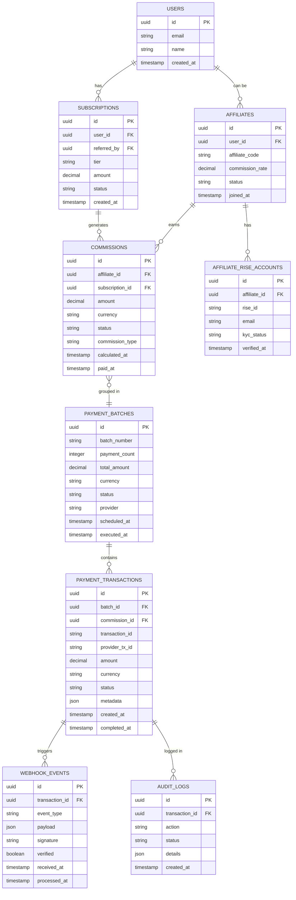

### Table Specifications

#### **affiliates**

```sql
CREATE TABLE affiliates (
    id UUID PRIMARY KEY DEFAULT gen_random_uuid(),
    user_id UUID NOT NULL REFERENCES users(id),
    affiliate_code VARCHAR(50) UNIQUE NOT NULL,
    commission_rate DECIMAL(5,2) NOT NULL DEFAULT 10.00,
    tier VARCHAR(50) DEFAULT 'standard',
    status VARCHAR(50) NOT NULL DEFAULT 'active',
    minimum_payout DECIMAL(10,2) DEFAULT 50.00,
    payment_schedule VARCHAR(50) DEFAULT 'monthly',
    joined_at TIMESTAMP NOT NULL DEFAULT NOW(),
    updated_at TIMESTAMP NOT NULL DEFAULT NOW(),
    CONSTRAINT valid_commission_rate CHECK (commission_rate >= 0 AND commission_rate <= 100),
    CONSTRAINT valid_status CHECK (status IN ('active', 'suspended', 'inactive'))
);

CREATE INDEX idx_affiliates_user_id ON affiliates(user_id);
CREATE INDEX idx_affiliates_code ON affiliates(affiliate_code);
CREATE INDEX idx_affiliates_status ON affiliates(status);
```

#### **affiliate_rise_accounts**

```sql
CREATE TABLE affiliate_rise_accounts (
    id UUID PRIMARY KEY DEFAULT gen_random_uuid(),
    affiliate_id UUID NOT NULL REFERENCES affiliates(id),
    rise_id VARCHAR(255) UNIQUE NOT NULL,
    email VARCHAR(255) NOT NULL,
    kyc_status VARCHAR(50) NOT NULL DEFAULT 'pending',
    kyc_completed_at TIMESTAMP,
    invitation_sent_at TIMESTAMP,
    invitation_accepted_at TIMESTAMP,
    last_sync_at TIMESTAMP,
    metadata JSONB,
    created_at TIMESTAMP NOT NULL DEFAULT NOW(),
    updated_at TIMESTAMP NOT NULL DEFAULT NOW(),
    CONSTRAINT valid_kyc_status CHECK (kyc_status IN ('pending', 'submitted', 'approved', 'rejected', 'expired'))
);

CREATE INDEX idx_rise_accounts_affiliate ON affiliate_rise_accounts(affiliate_id);
CREATE INDEX idx_rise_accounts_rise_id ON affiliate_rise_accounts(rise_id);
CREATE INDEX idx_rise_accounts_kyc_status ON affiliate_rise_accounts(kyc_status);
```

#### **commissions**

```sql
CREATE TABLE commissions (
    id UUID PRIMARY KEY DEFAULT gen_random_uuid(),
    affiliate_id UUID NOT NULL REFERENCES affiliates(id),
    subscription_id UUID NOT NULL REFERENCES subscriptions(id),
    amount DECIMAL(10,2) NOT NULL,
    currency VARCHAR(3) NOT NULL DEFAULT 'USD',
    commission_type VARCHAR(50) NOT NULL,
    status VARCHAR(50) NOT NULL DEFAULT 'pending',
    payment_batch_id UUID REFERENCES payment_batches(id),
    calculated_at TIMESTAMP NOT NULL DEFAULT NOW(),
    approved_at TIMESTAMP,
    paid_at TIMESTAMP,
    metadata JSONB,
    CONSTRAINT valid_amount CHECK (amount >= 0),
    CONSTRAINT valid_commission_type CHECK (commission_type IN ('new_subscription', 'renewal', 'upgrade', 'one_time')),
    CONSTRAINT valid_status CHECK (status IN ('pending', 'approved', 'queued', 'paid', 'cancelled', 'failed'))
);

CREATE INDEX idx_commissions_affiliate ON commissions(affiliate_id);
CREATE INDEX idx_commissions_subscription ON commissions(subscription_id);
CREATE INDEX idx_commissions_status ON commissions(status);
CREATE INDEX idx_commissions_batch ON commissions(payment_batch_id);
CREATE INDEX idx_commissions_calculated_at ON commissions(calculated_at);
```

#### **payment_batches**

```sql
CREATE TABLE payment_batches (
    id UUID PRIMARY KEY DEFAULT gen_random_uuid(),
    batch_number VARCHAR(50) UNIQUE NOT NULL,
    payment_count INTEGER NOT NULL DEFAULT 0,
    total_amount DECIMAL(12,2) NOT NULL DEFAULT 0.00,
    currency VARCHAR(3) NOT NULL DEFAULT 'USD',
    provider VARCHAR(50) NOT NULL,
    status VARCHAR(50) NOT NULL DEFAULT 'pending',
    scheduled_at TIMESTAMP NOT NULL,
    executed_at TIMESTAMP,
    completed_at TIMESTAMP,
    failed_at TIMESTAMP,
    error_message TEXT,
    metadata JSONB,
    created_at TIMESTAMP NOT NULL DEFAULT NOW(),
    updated_at TIMESTAMP NOT NULL DEFAULT NOW(),
    CONSTRAINT valid_payment_count CHECK (payment_count >= 0),
    CONSTRAINT valid_total_amount CHECK (total_amount >= 0),
    CONSTRAINT valid_provider CHECK (provider IN ('rise', 'mock')),
    CONSTRAINT valid_status CHECK (status IN ('pending', 'queued', 'processing', 'completed', 'failed', 'cancelled'))
);

CREATE INDEX idx_batches_status ON payment_batches(status);
CREATE INDEX idx_batches_scheduled ON payment_batches(scheduled_at);
CREATE INDEX idx_batches_provider ON payment_batches(provider);
CREATE INDEX idx_batches_number ON payment_batches(batch_number);
```

#### **payment_transactions**

```sql
CREATE TABLE payment_transactions (
    id UUID PRIMARY KEY DEFAULT gen_random_uuid(),
    batch_id UUID NOT NULL REFERENCES payment_batches(id),
    commission_id UUID NOT NULL REFERENCES commissions(id),
    transaction_id VARCHAR(100) UNIQUE NOT NULL,
    provider_tx_id VARCHAR(255),
    provider VARCHAR(50) NOT NULL,
    payee_rise_id VARCHAR(255),
    amount DECIMAL(10,2) NOT NULL,
    currency VARCHAR(3) NOT NULL DEFAULT 'USD',
    status VARCHAR(50) NOT NULL DEFAULT 'pending',
    retry_count INTEGER DEFAULT 0,
    last_retry_at TIMESTAMP,
    error_message TEXT,
    metadata JSONB,
    created_at TIMESTAMP NOT NULL DEFAULT NOW(),
    completed_at TIMESTAMP,
    failed_at TIMESTAMP,
    CONSTRAINT valid_amount CHECK (amount > 0),
    CONSTRAINT valid_provider CHECK (provider IN ('rise', 'mock')),
    CONSTRAINT valid_status CHECK (status IN ('pending', 'processing', 'completed', 'failed', 'cancelled'))
);

CREATE INDEX idx_transactions_batch ON payment_transactions(batch_id);
CREATE INDEX idx_transactions_commission ON payment_transactions(commission_id);
CREATE INDEX idx_transactions_status ON payment_transactions(status);
CREATE INDEX idx_transactions_provider_tx ON payment_transactions(provider_tx_id);
CREATE INDEX idx_transactions_created_at ON payment_transactions(created_at);
```

#### **webhook_events**

```sql
CREATE TABLE webhook_events (
    id UUID PRIMARY KEY DEFAULT gen_random_uuid(),
    transaction_id UUID REFERENCES payment_transactions(id),
    event_type VARCHAR(100) NOT NULL,
    provider VARCHAR(50) NOT NULL,
    payload JSONB NOT NULL,
    signature VARCHAR(500),
    hash VARCHAR(500),
    verified BOOLEAN DEFAULT FALSE,
    processed BOOLEAN DEFAULT FALSE,
    received_at TIMESTAMP NOT NULL DEFAULT NOW(),
    processed_at TIMESTAMP,
    error_message TEXT,
    CONSTRAINT valid_provider CHECK (provider IN ('rise', 'mock'))
);

CREATE INDEX idx_webhooks_transaction ON webhook_events(transaction_id);
CREATE INDEX idx_webhooks_type ON webhook_events(event_type);
CREATE INDEX idx_webhooks_processed ON webhook_events(processed);
CREATE INDEX idx_webhooks_received ON webhook_events(received_at);
```

#### **audit_logs**

```sql
CREATE TABLE audit_logs (
    id UUID PRIMARY KEY DEFAULT gen_random_uuid(),
    transaction_id UUID REFERENCES payment_transactions(id),
    batch_id UUID REFERENCES payment_batches(id),
    action VARCHAR(100) NOT NULL,
    actor VARCHAR(100),
    status VARCHAR(50) NOT NULL,
    details JSONB,
    ip_address INET,
    user_agent TEXT,
    created_at TIMESTAMP NOT NULL DEFAULT NOW(),
    CONSTRAINT valid_status CHECK (status IN ('success', 'failure', 'warning', 'info'))
);

CREATE INDEX idx_audit_transaction ON audit_logs(transaction_id);
CREATE INDEX idx_audit_batch ON audit_logs(batch_id);
CREATE INDEX idx_audit_action ON audit_logs(action);
CREATE INDEX idx_audit_created ON audit_logs(created_at);
```

### Data Flow Diagrams

#### Commission Calculation Flow

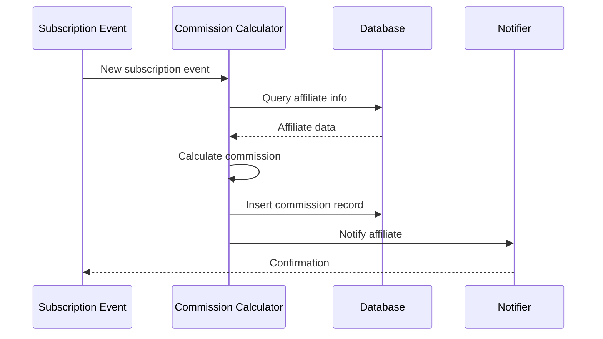

#### Payment Execution Flow

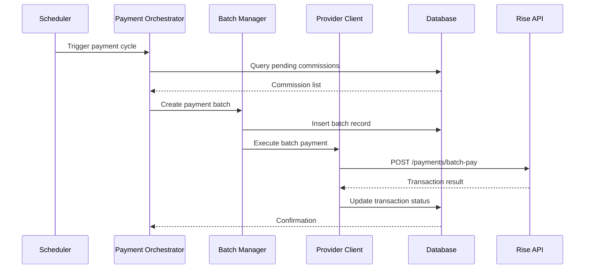

#### Webhook Processing Flow

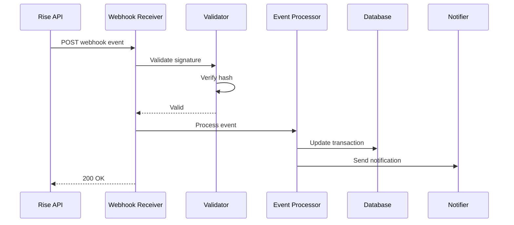

---

## Integration Architecture

### Rise API Integration Points

#### Authentication Flow

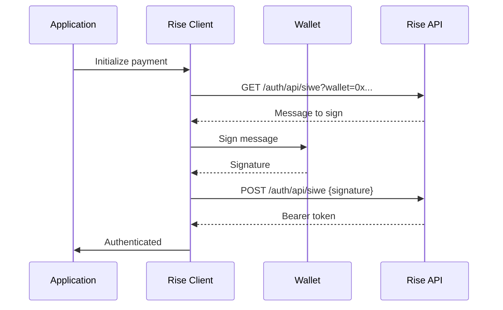

#### Payment Flow

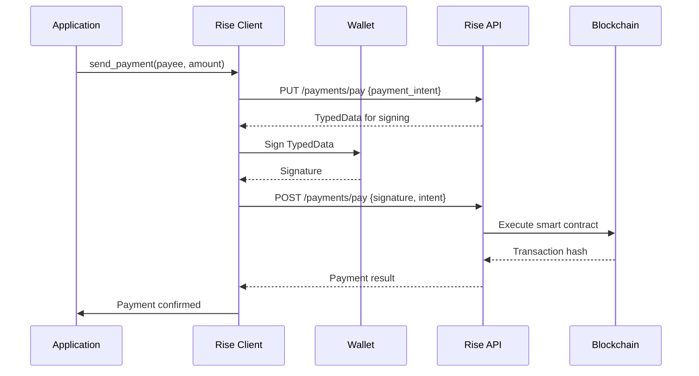

### API Endpoint Mapping

#### **Authentication Endpoints**

```
GET  /auth/api/siwe
POST /auth/api/siwe
```

#### **Payment Endpoints**

```
PUT  /payments/pay              # Request payment intent
POST /payments/pay              # Execute payment
PUT  /payments/batch-pay        # Request batch intent
POST /payments/batch-pay        # Execute batch
GET  /payments/{tx_id}          # Get payment status
```

#### **RiseID Endpoints**

```
GET  /riseid/{rise_id}/balance  # Get account balance
GET  /riseid/{rise_id}          # Get RiseID info
POST /riseid/invite             # Invite new payee
```

#### **Webhook Endpoints** (Our Implementation)

```
POST /webhooks/rise             # Receive Rise events
```

### Provider Configuration Schema

```yaml
payment_providers:
  rise:
    enabled: false # Toggle for production
    base_url: 'https://b2b-api.riseworks.io/v1'
    staging_url: 'https://b2b-api.staging-riseworks.io/v1'
    environment: 'staging' # staging | production
    wallet:
      address: '${RISE_WALLET_ADDRESS}'
      private_key: '${RISE_WALLET_PRIVATE_KEY}'
    company:
      rise_id: '${RISE_COMPANY_ID}'
      manager_email: '${RISE_MANAGER_EMAIL}'
    api:
      timeout: 30
      retry_attempts: 3
      retry_delay: 5
      max_batch_size: 100
    webhooks:
      enabled: true
      endpoint: '/webhooks/rise'
      signer_address: '${RISE_SIGNER_ADDRESS}'
    features:
      batch_payments: true
      auto_invite: true
      webhook_verification: true

  mock:
    enabled: true # Default for development
    simulated_delay: 2 # seconds
    failure_rate: 0.0 # 0.0 - 1.0
    features:
      simulate_webhooks: true
      generate_realistic_ids: true
```

### Environment Variables

```bash
# Payment Provider Selection
PAYMENT_PROVIDER=mock  # mock | rise

# Rise Configuration
RISE_ENABLED=false
RISE_ENVIRONMENT=staging  # staging | production
RISE_API_BASE_URL=https://b2b-api.staging-riseworks.io/v1
RISE_WALLET_ADDRESS=0x...
RISE_WALLET_PRIVATE_KEY=0x...
RISE_COMPANY_ID=0x...
RISE_MANAGER_EMAIL=admin@tradingalerts.example
RISE_SIGNER_ADDRESS=0x...

# Payment Scheduling
PAYMENT_SCHEDULE_ENABLED=true
PAYMENT_SCHEDULE_DAILY_TIME=00:00
PAYMENT_SCHEDULE_TIMEZONE=UTC
PAYMENT_MINIMUM_THRESHOLD=50.00
PAYMENT_BATCH_SIZE=100

# Webhook Configuration
WEBHOOK_VERIFICATION_ENABLED=true
WEBHOOK_SIGNATURE_REQUIRED=true

# Feature Flags
FEATURE_BATCH_PAYMENTS=true
FEATURE_AUTO_AFFILIATE_INVITE=true
FEATURE_WEBHOOK_PROCESSING=true
```

---

## Security Architecture

### Authentication & Authorization

#### API Authentication

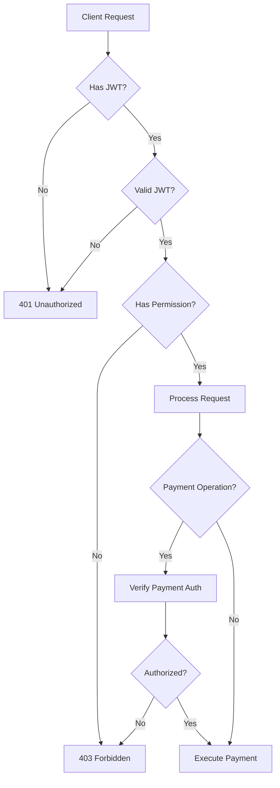

#### Rise API Authentication

- **Method**: Ethereum wallet signature (SIWE - Sign-In with Ethereum)
- **Token**: JWT bearer token with 24-hour expiry
- **Refresh**: Automatic re-authentication on token expiry
- **Wallet Security**: Private key stored in secure environment variables

#### Payment Authorization Levels

```
Admin:
  - Create payment batches
  - Execute payments
  - Cancel payments
  - View all transactions
  - Configure payment settings

Manager:
  - View payment batches
  - View transactions
  - Export reports

Affiliate:
  - View own commissions
  - View payment history
  - Update payment preferences
```

### Data Security

#### Sensitive Data Handling

```yaml
encryption_at_rest:
  - wallet_private_keys: AES-256
  - api_tokens: Encrypted in memory
  - transaction_details: Database encryption

encryption_in_transit:
  - all_api_calls: TLS 1.3
  - webhook_endpoints: HTTPS only
  - internal_services: mTLS (future)

secrets_management:
  provider: Environment variables + Railway secrets
  rotation: Manual (quarterly recommended)
  access: Restricted to deployment pipeline
```

#### PII (Personally Identifiable Information)

```
Data Classification:
- High Sensitivity: Wallet keys, API keys
- Medium Sensitivity: Email, Rise IDs, transaction amounts
- Low Sensitivity: Commission rates, payment schedules

Compliance Requirements:
- GDPR: Right to deletion, data export
- PCI: Not applicable (no card data)
- Financial Records: 7-year retention
```

### Webhook Security

#### Verification Process

```python
def verify_webhook(request):
    # Extract headers
    payload_hash = request.headers.get('x-rise-hash')
    signature = request.headers.get('x-rise-signature')

    # Verify hash
    calculated_hash = keccak256(request.body)
    if calculated_hash != payload_hash:
        return False

    # Verify signature
    recovered_address = recover_address(payload_hash, signature)
    if recovered_address != RISE_SIGNER_ADDRESS:
        return False

    return True
```

#### Replay Attack Prevention

- Timestamp validation (reject events > 5 minutes old)
- Event ID tracking (reject duplicate events)
- Signature verification on every request

### Error Handling Security

#### Information Disclosure Prevention

```yaml
error_responses:
  production:
    - Generic error messages
    - No stack traces
    - Logged internally only

  development:
    - Detailed error messages
    - Stack traces enabled
    - Debug information visible

rate_limiting:
  api_endpoints: 100 requests/minute/IP
  webhook_endpoint: 1000 requests/minute
  payment_operations: 10 concurrent/user
```

---

## Configuration Architecture

### Configuration Hierarchy

```
Default Config (code)
    ↓
Environment Config (.env)
    ↓
Railway Secrets (production)
    ↓
Runtime Overrides (admin panel)
```

### Configuration Schema

```python
@dataclass
class PaymentConfig:
    provider: str  # 'mock' | 'rise'
    enabled: bool
    min_payout: Decimal
    batch_size: int
    schedule: PaymentSchedule
    retry_policy: RetryPolicy
    notification_settings: NotificationConfig

@dataclass
class RiseConfig:
    base_url: str
    wallet_address: str
    wallet_private_key: str  # Encrypted
    company_rise_id: str
    timeout: int
    retry_attempts: int
    webhook_enabled: bool
    webhook_signer: str

@dataclass
class PaymentSchedule:
    enabled: bool
    frequency: str  # 'daily' | 'weekly' | 'monthly'
    day_of_week: Optional[int]  # 0-6 for weekly
    day_of_month: Optional[int]  # 1-31 for monthly
    time: str  # HH:MM format
    timezone: str

@dataclass
class RetryPolicy:
    max_attempts: int
    initial_delay: int  # seconds
    max_delay: int
    backoff_multiplier: float  # Exponential backoff
```

### Feature Flags

```python
class PaymentFeatures:
    BATCH_PAYMENTS = "batch_payments"
    AUTO_INVITE = "auto_affiliate_invite"
    WEBHOOK_PROCESSING = "webhook_processing"
    EMAIL_NOTIFICATIONS = "email_notifications"
    ADMIN_NOTIFICATIONS = "admin_notifications"
    PAYMENT_SCHEDULING = "payment_scheduling"

    # Future features
    MULTI_CURRENCY = "multi_currency_support"
    CRYPTO_PAYMENTS = "crypto_payments"
    INSTANT_PAYOUTS = "instant_payouts"
```

---

## Testing Architecture

### Testing Strategy

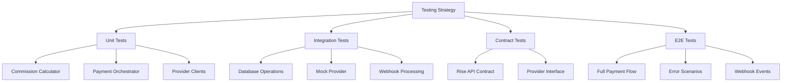

### Test Environments

#### Local Development

```yaml
database: PostgreSQL (Docker)
payment_provider: mock
webhooks: ngrok tunnel
features: all enabled
data: seed test data
```

#### CI/CD Pipeline

```yaml
database: PostgreSQL (ephemeral)
payment_provider: mock
webhooks: disabled
features: all enabled
data: automated fixtures
```

#### Staging (Railway)

```yaml
database: PostgreSQL (Railway)
payment_provider: rise (staging API)
webhooks: enabled
features: all enabled
data: synthetic test data
```

#### Production (Railway)

```yaml
database: PostgreSQL (Railway)
payment_provider: rise (production API)
webhooks: enabled
features: configured per environment
data: live data
```

### Test Coverage Targets

```yaml
unit_tests:
  coverage: 90%
  components:
    - Commission calculator: 95%
    - Payment orchestrator: 90%
    - Provider clients: 95%
    - Webhook handlers: 90%

integration_tests:
  coverage: 80%
  scenarios:
    - Payment lifecycle
    - Batch processing
    - Error handling
    - Webhook processing

e2e_tests:
  coverage: Critical paths
  scenarios:
    - Complete commission flow
    - Provider switching
    - Failure recovery
```

### Mock Provider Capabilities

```python
class MockPaymentClient:
    def configure_scenario(self, scenario: str):
        """
        Scenarios:
        - 'success': All payments succeed
        - 'partial_failure': 20% fail randomly
        - 'timeout': Simulate network timeout
        - 'rate_limit': Simulate API rate limiting
        - 'invalid_payee': Payee not found
        - 'insufficient_funds': Balance too low
        """
        pass

    def set_delay(self, min_seconds: int, max_seconds: int):
        """Simulate realistic network latency"""
        pass

    def trigger_webhook(self, event_type: str, transaction_id: str):
        """Manually trigger webhook events"""
        pass
```

---

## Deployment Architecture

### Deployment Topology

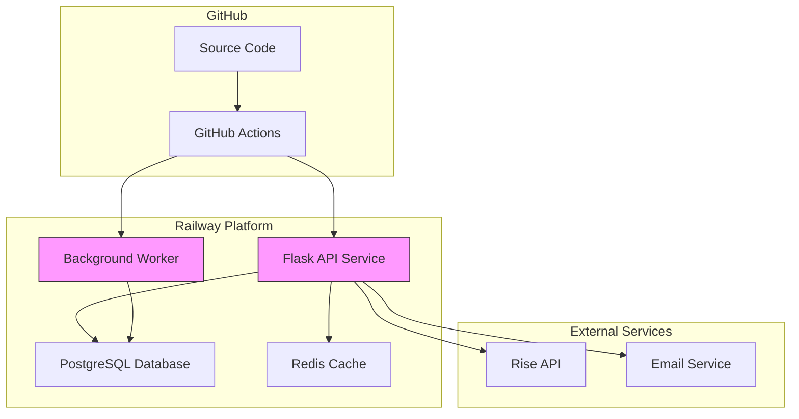

### Service Components

#### Flask API Service

```yaml
runtime: Python 3.11
framework: Flask
ports: 5000
instances: 2 (production)
resources:
  memory: 512MB
  cpu: 0.5 vCPU
environment: Railway
```

#### Background Worker (Future)

```yaml
runtime: Python 3.11
framework: Celery/APScheduler
workers: 2
tasks:
  - commission_calculation
  - payment_scheduling
  - batch_execution
  - webhook_processing
```

### Deployment Pipeline

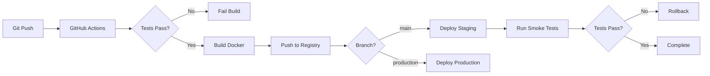

### Environment Configuration

#### Development

```yaml
environment: development
payment_provider: mock
database: local PostgreSQL
logging: DEBUG
features: all enabled
webhooks: ngrok
```

#### Staging

```yaml
environment: staging
payment_provider: rise (staging)
database: Railway PostgreSQL
logging: INFO
features: all enabled
webhooks: Railway URL
```

#### Production

```yaml
environment: production
payment_provider: rise (production)
database: Railway PostgreSQL
logging: WARNING
features: configured
webhooks: Railway URL
monitoring: enabled
```

### Container Configuration

```dockerfile
# Dockerfile excerpt for payment service
FROM python:3.11-slim

WORKDIR /app

# Install dependencies
COPY requirements.txt .
RUN pip install --no-cache-dir -r requirements.txt

# Copy application
COPY . .

# Environment
ENV FLASK_APP=app.py
ENV PAYMENT_PROVIDER=mock

# Expose ports
EXPOSE 5000

# Health check
HEALTHCHECK --interval=30s --timeout=3s \
  CMD curl -f http://localhost:5000/health || exit 1

# Run application
CMD ["gunicorn", "--bind", "0.0.0.0:5000", "--workers", "2", "app:app"]
```

### Database Migration Strategy

```yaml
migration_tool: Alembic
strategy: Blue-Green deployment
process: 1. Create migration scripts
  2. Test in staging
  3. Apply to production (backward compatible)
  4. Deploy new code
  5. Remove deprecated columns (next release)

rollback_plan:
  - All migrations reversible
  - Data backups before migration
  - Previous version compatible with new schema
```

---

## Monitoring & Observability

### Metrics to Track

#### Payment Metrics

```yaml
business_metrics:
  - total_commissions_calculated
  - total_commissions_paid
  - average_commission_amount
  - commission_payout_rate
  - affiliate_participation_rate
  - payment_success_rate
  - payment_failure_rate
  - average_payment_time

technical_metrics:
  - api_request_count
  - api_response_time
  - api_error_rate
  - batch_size_distribution
  - webhook_processing_time
  - database_query_time
  - cache_hit_rate

financial_metrics:
  - total_payout_volume
  - payment_fees
  - currency_distribution
  - payout_by_country
```

### Logging Strategy

```python
# Structured logging format
{
    "timestamp": "2025-11-27T23:50:00Z",
    "level": "INFO",
    "service": "payment-service",
    "component": "payment_orchestrator",
    "action": "execute_batch_payment",
    "batch_id": "batch_123",
    "payment_count": 25,
    "total_amount": 1250.00,
    "provider": "rise",
    "status": "success",
    "duration_ms": 3450,
    "metadata": {
        "user_id": "admin_001",
        "ip_address": "10.0.0.1"
    }
}
```

### Alert Configuration

```yaml
critical_alerts:
  - name: 'Payment Failure Rate High'
    condition: failure_rate > 5%
    duration: 15 minutes
    action: Page on-call engineer

  - name: 'Rise API Down'
    condition: api_availability < 99%
    duration: 5 minutes
    action: Email + Slack

  - name: 'Batch Execution Failed'
    condition: batch_status = failed
    duration: immediate
    action: Email admin

warning_alerts:
  - name: 'Payment Processing Slow'
    condition: avg_processing_time > 10s
    duration: 30 minutes
    action: Slack notification

  - name: 'High Commission Volume'
    condition: pending_commissions > 1000
    duration: 1 hour
    action: Email admin
```

### Health Checks

```python
# Health check endpoint
@app.route('/health')
def health_check():
    checks = {
        "database": check_database_connection(),
        "payment_provider": check_payment_provider(),
        "cache": check_cache_connection(),
        "webhook_receiver": check_webhook_endpoint()
    }

    status = "healthy" if all(checks.values()) else "degraded"

    return {
        "status": status,
        "checks": checks,
        "timestamp": datetime.utcnow().isoformat()
    }
```

---

## Future Considerations

### Phase 2 Enhancements

#### Multi-Currency Support

- Support multiple currencies (USD, EUR, GBP, THB)
- Automatic currency conversion
- Regional payment preferences
- Currency-specific minimum thresholds

#### Cryptocurrency Payments

- USDC/USDT stablecoin payouts
- Crypto wallet integration
- Automatic fiat ↔ crypto conversion
- Tax implications handling

#### Advanced Scheduling

- Dynamic payment schedules per affiliate
- Payment windows based on time zones
- Holiday awareness (skip payment dates)
- Instant payout option (premium feature)

### Scalability Considerations

```yaml
current_capacity:
  affiliates: 1000
  payments_per_month: 10000
  batch_size: 100

scale_targets:
  year_1:
    affiliates: 10000
    payments_per_month: 100000

  year_2:
    affiliates: 50000
    payments_per_month: 500000

scaling_strategy:
  - Horizontal scaling: Multiple worker instances
  - Database: Read replicas for reporting
  - Caching: Redis for frequently accessed data
  - Queue: Message queue for async processing
```

### Alternative Providers

```yaml
provider_comparison:
  rise:
    pros: [Global coverage, Crypto support, AOR model]
    cons: [Setup complexity, API learning curve]
    fit: Excellent for current needs

  stripe_connect:
    pros: [Easy integration, Well documented]
    cons: [Limited global coverage, Higher fees]
    fit: Alternative for US/EU focused

  paypal_payouts:
    pros: [Widely adopted, Simple API]
    cons: [High fees, Limited currencies]
    fit: Backup option

  wise_api:
    pros: [Low fees, Many currencies]
    cons: [Business account required]
    fit: Future consideration
```

### Integration Opportunities

- **Accounting Systems**: QuickBooks, Xero integration
- **Tax Reporting**: Automatic 1099/W8BEN generation
- **Analytics**: Enhanced reporting dashboard
- **CRM**: Affiliate relationship management
- **Marketing**: Automated affiliate onboarding campaigns

---

## Appendix

### Glossary

**AOR (Agent of Record)**: Legal model where Rise acts as intermediary between company and contractors

**KYC (Know Your Customer)**: Identity verification process required by Rise

**RiseID**: Unique blockchain address identifying a Rise account (smart contract)

**TypedData**: Ethereum standard for structured data signing (EIP-712)

**Webhook**: HTTP callback for asynchronous event notification

**Batch Payment**: Group of multiple payments executed in single transaction

**Commission**: Affiliate earnings from referred subscriptions

**Payee**: Person receiving payment (affiliate)

**Payer**: Entity sending payment (your SaaS company)

**Salt**: Unique value preventing transaction replay attacks

**SIWE**: Sign-In with Ethereum, authentication method using wallet signatures

### Reference Documents

- Rise API Documentation: https://docs.riseworks.io/
- Trading Alerts SaaS V7 Architecture: [Link to main architecture doc]
- Database Schema Specification: [Link to schema doc]
- Security Policy: [Link to security doc]

### Version History

| Version | Date       | Author            | Changes                     |
| ------- | ---------- | ----------------- | --------------------------- |
| 1.0.0   | 2025-11-27 | Architecture Team | Initial architecture design |

---

## Document Purpose & Usage

**Target Audience**: Claude Code (web) for implementation planning

**Next Steps**:

1. Claude Code reads this architecture design
2. Claude Code generates detailed implementation plan (How To)
3. Implementation plan guides Aider for code generation
4. Implementation validates against this architecture

**Success Criteria**:

- All components described are implementable
- Database schema supports all use cases
- Security requirements are clear
- Testing strategy is comprehensive
- Deployment approach is practical

---

_This architecture design document defines WHAT the Rise payment integration stack is and HOW it fits into Trading Alerts SaaS V7. The implementation plan (generated by Claude Code) will define HOW TO build it, and Aider will execute the actual code implementation._
